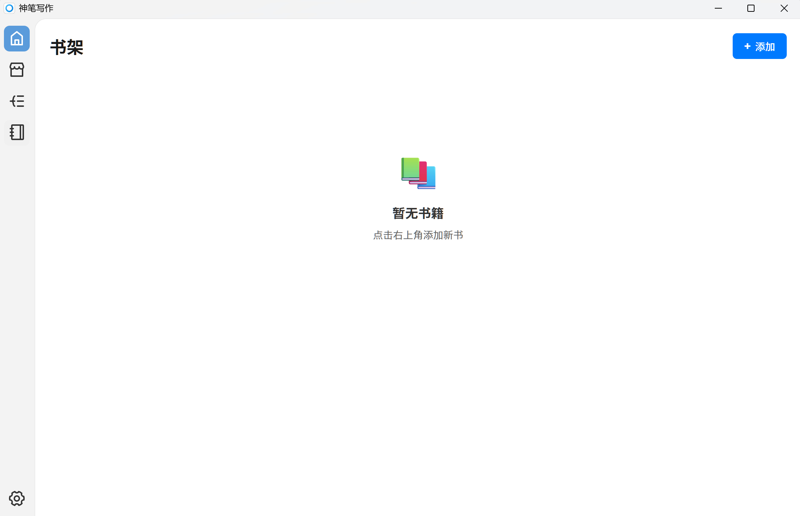
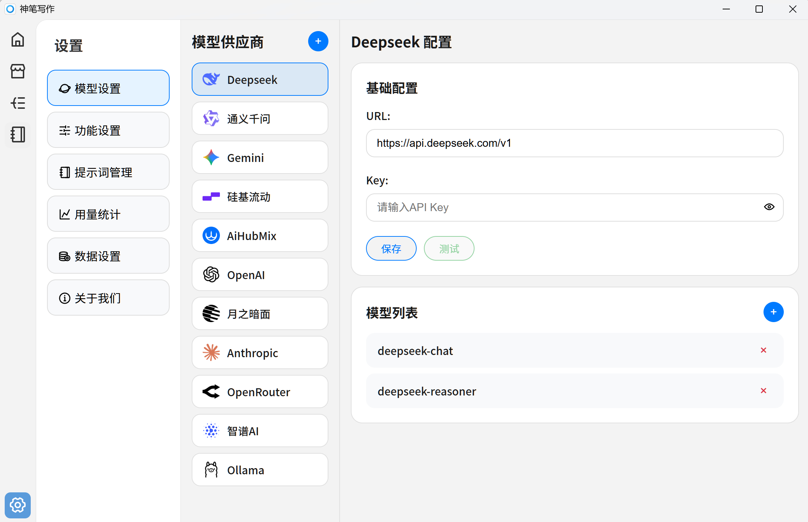
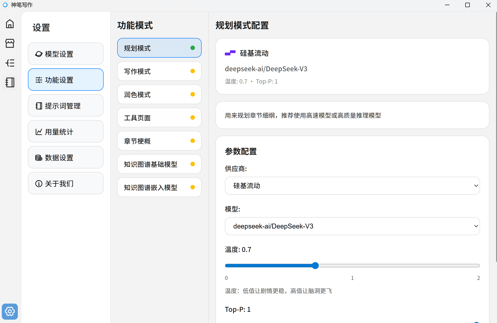

# 软件配置

在神笔写作首次使用时，需要进行相关配置，以便后续使用

## 启动应用

- 双击桌面上的"神笔写作"图标
- 或从开始菜单搜索"神笔写作"

## 配置模型设置

1. 进入"设置" → "模型设置"
2. 选择您想使用的 AI 提供商（OpenAI、Claude、DeepSeek 等）
3. 输入您的 API 密钥
4. 点击"测试"确保配置成功
5. 推荐国内用户使用**硅基流动**[官网](https://cloud.siliconflow.cn/i/BT2o4ohd)和**AiHubMix（推理时代）**[官网](https://aihubmix.com?aff=4SXn)

## 配置功能设置

1. 进入"设置" → "功能设置"
2. 根据不同的功能特点配置不同模型
3. 点击保存即可配置成功
4. 一些功能设置的推荐（性价比优先策略）
   - 规划模式：deepseek-v3
   - 写作模式：gemini-2.5-pro
   - 章节梗概：deepseek-v3
   - 知识图谱基础模型：deepseek-v3
   - 知识图谱嵌入模型：bge-m3（在硅基流动为免费模型）
   - 其他功能为独立功能，可自由配置

