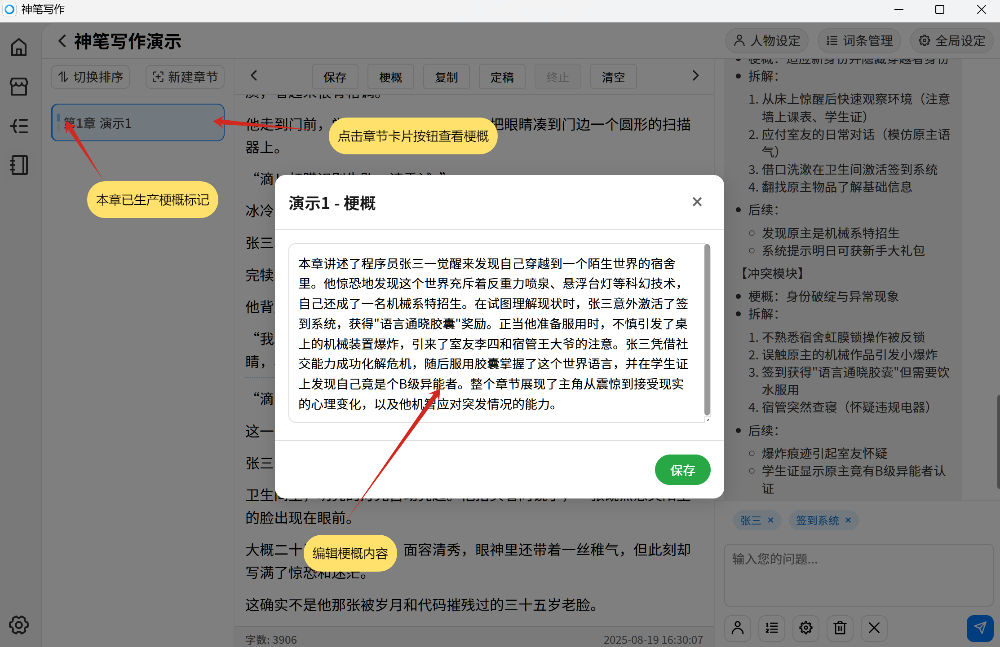

# 正文编辑

正文创作以后，需要进行一系列的编辑确定最终版本。

## 编辑器介绍

中间的编辑器顶部为工具栏，中间为内容编辑区域，底部为状态栏

## 内容编辑

可以直接进行内容编辑，增加或删除内容。
在编辑器内每 **1000** 字所在段落下方会显示数字里程碑标记，帮助用户了解字符数量。

## 生成梗概

确定正文最终版本后，点击上方**梗概**按钮生产本章梗概。

- 生成梗概能更好的帮助 AI 在后续章节创作中了解前文章节内容，让剧情更连贯。

## 定稿功能

定稿功能又名为知识图谱生产器，需要配置知识图谱基础默契和嵌入模型。

- 注意定稿功能需要消耗几分钟以及大量 Token
- 定稿功能生成内容会构成图 RAG 系统，赋予 AI 长记忆能力。
- 在规划模式和正文模式创作时，都会自动进行检索以往记忆来帮助创作。
- 了解知识图谱详细内容 👉[知识图谱](/guide/knowledgegraph)

