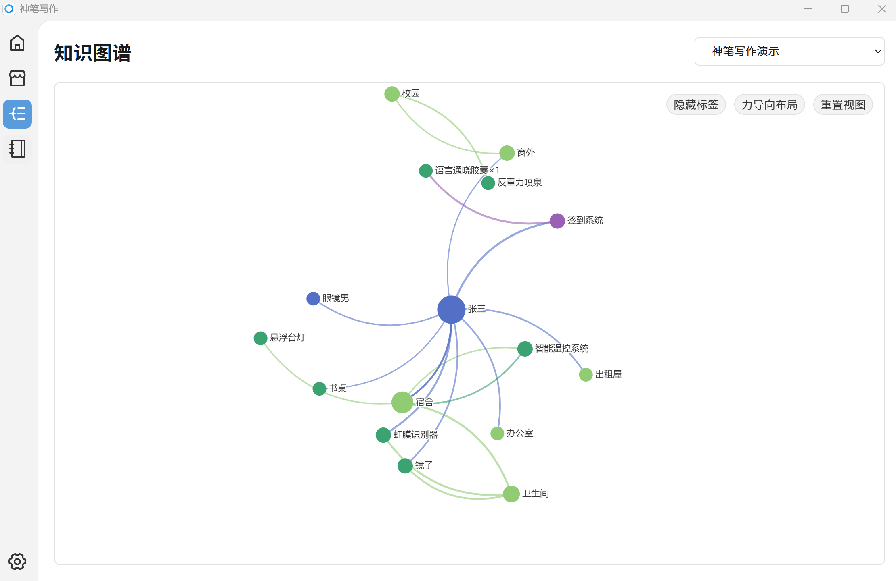
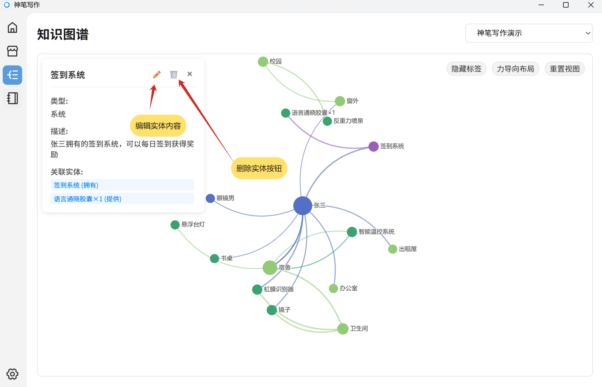
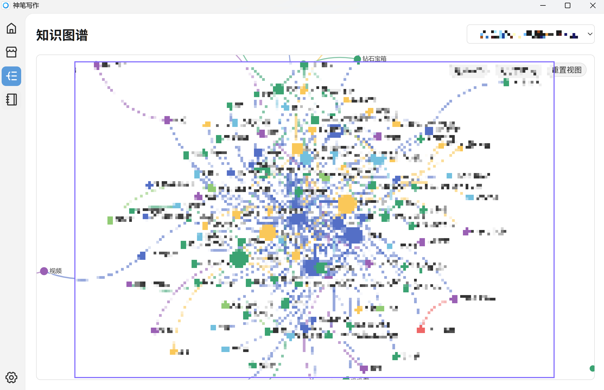

# 知识图谱

知识图谱系统是一种书籍 RAG 系统，帮助大模型在后续创作中了解前文信息。

## 演示页面

知识图谱页面支持切换不同书籍的知识图谱，并对内容进行编辑删除等。

## 编辑内容

编辑功能使用提示：

- 编辑实体名称为其他实体名称时，会合并实体为一个。
- 删除实体时会删除本实体链接的关系。
- 删除关系时不会删除两边的实体。

## 使用提示

注意，当章节越来越多时，实体及关系肯定会越来越多，要及时的清理小说情节中不在需要的实体及关系。

- 及时清理旧的实体和关系可以避免在新章节时提供过时的信息。
- 及时清理可以减少软件卡顿。
- 及时清理可以减少软件空间占用。

  
