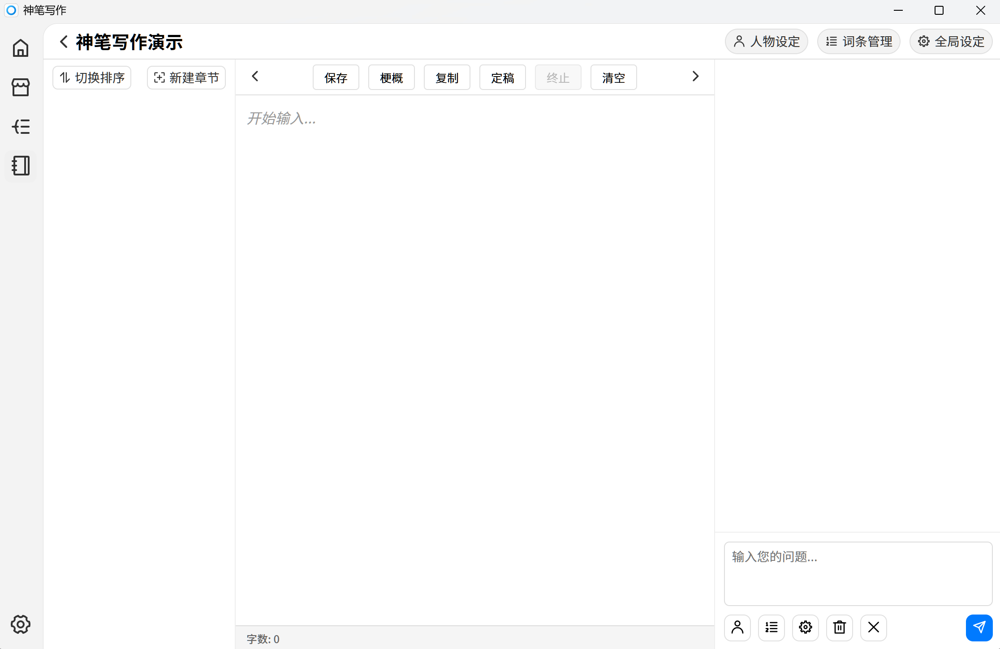

# 开始写作

开始了解神笔软件中写作界面各部分的使用方法

## 创建书籍

点击首页的“添加”按钮并输入名称来创建书籍

## 写作界面

#### 1. 写作界面分为 4 个部分，顶部左侧是当前书籍名称，右侧是书籍关联内容和全局设定

- 人物设定：为本书涉及到的人物进行详细设定。
- 词条设定：除了人物以外，对物品，事件，系统等进行详细的设定。
- 全局设定：本书的基本信息和世界观设定。
- 注意：以上三条内容均可根据剧情发展进行随时的修改。

#### 2. 主要区域使用三栏设计

- 左侧为章节管理区域，可以创建和删除章节，查看章节梗概信息及状态。
- 中间为内容编辑区域，顶部拥有工具栏。
- 右侧为 AI 交互区域，进行上下文构建，AI 交互。

#### 3. AI 对话区域介绍

- 左侧创建章节后，选中这个章节。
- 在右侧选择合适的人物词条等信息，并输入对本章的想法

#### 4. 对话内容编辑

- 右侧区域调用的是**规划模式**的大模型及提示词，目标是通过修改或多轮对话生产满意的章节细纲。
- 支持手动对 AI 生成内容进行修改

#### 5. 开始写作

- 确定最终的**章节细纲**之后，点击**开始写作按钮**调用**写作模式**进行章节创作
- 进入正文编辑页面了解更多内容。👉[正文编辑](/guide/editor-writing)

