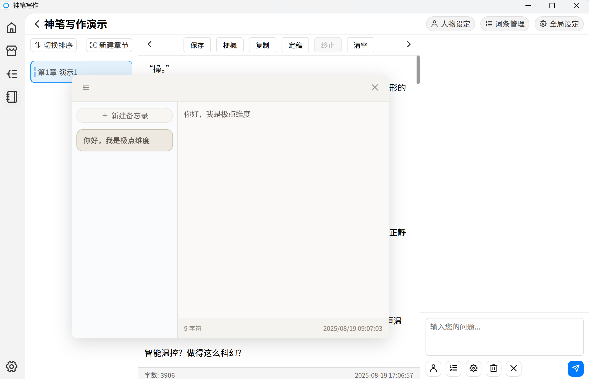
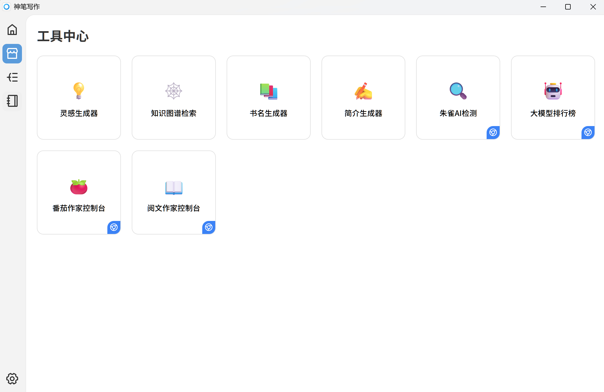
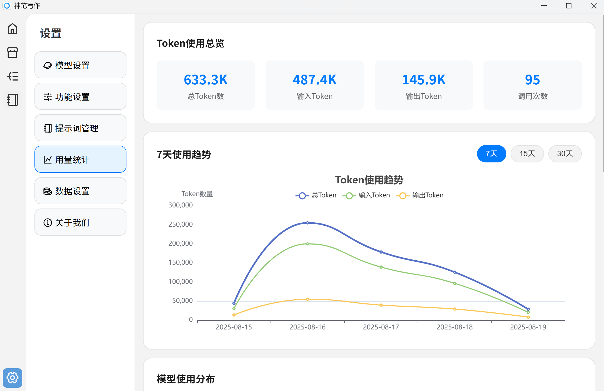
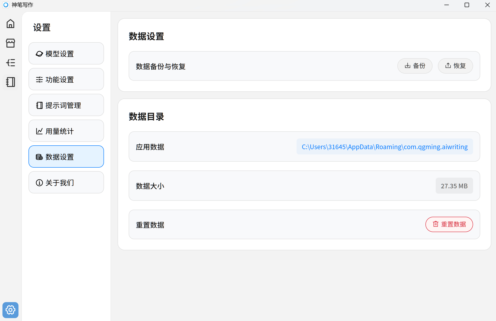

# 写作工具

为了更好的创作体验，神笔写作中提供了众多有用的工具

## 全局备忘录

在侧边栏可以点开一个全局备忘录。

- 备忘录拥有记忆功能，可以保存内容。
- 备忘录可以全局显示，拖动可以移动位置

## 工具页面

神笔写作提供一个独立的工具页面，内置多种工具。

## 用量统计

神笔写作软件会通过本地的算法来预估每次调用 AI 时消耗的 Token。

- 注意：仅为预估值，请在 API 供应商处查看详细内容。

## 数据管理

软件内提供数据备份及恢复功能

- 软件备份是整个数据库，包含书籍内容也包含设置信息。
- 如果把备份数据包发给其他朋友，会恢复完整软件书籍，包含密钥。这可能导致 key 泄露，请注意。

